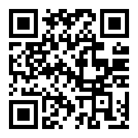

# Parallex

## Summary

`ParallEx` is a group of common parallel collections. The intent is to make it easy to process large amounts of data.

## Goals

1. Create immutable parallel collections for Elixir.
2. Conform to the existing Enum protocol.
3. Vastly improve the performance of sequential collections of large data sets.
4. Use the sequential data structures as-is where possible.
5. Allow for other sequential collections to be easily parallelized.

The initial design of `ParallEx` is largely influenced by the design of Scala's and Clojure's parallel collections. `ParallEx` also references [A Generic Parallel Collection Framework by Aleksandar Prokopec, Tiark Rompf, Phil Bagwell, and Martin Odersky][1]

## Usage

### Data Structures

Currently, `ParallEx` supports the following data structures. More will come.

1. `List`
2. `HashDict`
3. `HashSet`
4. `Range`

### Operations

`ParallEx` supports a subset of the `Enum` operations. More will come over time; however, some of the `Enum` operations are not parallelizable. The supported operations include:

1. `reduce`
2. `map`
3. `filter`
4. `each`
5. `count`
6. `member?`

## Contributions

### Code Contributions

Feature requests and bug fixes can be submitted through the issues page. If there is an issue you would like to address, please feel free to submit a pull request. There is still much work to do, so please contribute.

All pull requests should be accompanied by appropriate tests. 

### Monetary contributions

If you don't have the time or skills to contribute pull requests, monetary contributions can be made through [Flattr][2] or Bitcoin.

#### Flattr

Contributing through Flattr takes three easy steps:

1. Sign up for [Flattr][2].
2. Set your donation amount.
3. "Star" `ParallEx` on GitHub.

#### Bitcoin

Contributing through Bitcoin is also available:

1. Choose a Bitcoin wallet service ([Blockchain][3], [Hive][4], etc).
2. Purchase or mine some Bitcoins.
3. Send Bitcoins to `1EEaYPdGQey6imbcGDSfDAiaZ6wVVB9pia` or scan the following QR code.

## License

`ParallEx` is licensed under the MIT license, which is reproduced in its entirety here:

>Copyright (c) 2014 Robert Brown
>
>Permission is hereby granted, free of charge, to any person obtaining a copy
>of this software and associated documentation files (the "Software"), to deal
>in the Software without restriction, including without limitation the rights
>to use, copy, modify, merge, publish, distribute, sublicense, and/or sell
>copies of the Software, and to permit persons to whom the Software is
>furnished to do so, subject to the following conditions:
>
>The above copyright notice and this permission notice shall be included in
>all copies or substantial portions of the Software.
>
>THE SOFTWARE IS PROVIDED "AS IS", WITHOUT WARRANTY OF ANY KIND, EXPRESS OR
>IMPLIED, INCLUDING BUT NOT LIMITED TO THE WARRANTIES OF MERCHANTABILITY,
>FITNESS FOR A PARTICULAR PURPOSE AND NONINFRINGEMENT. IN NO EVENT SHALL THE
>AUTHORS OR COPYRIGHT HOLDERS BE LIABLE FOR ANY CLAIM, DAMAGES OR OTHER
>LIABILITY, WHETHER IN AN ACTION OF CONTRACT, TORT OR OTHERWISE, ARISING FROM,
>OUT OF OR IN CONNECTION WITH THE SOFTWARE OR THE USE OR OTHER DEALINGS IN
>THE SOFTWARE.

  [1]: http://infoscience.epfl.ch/record/150220/files/pc.pdf
  [2]: https://flattr.com
  [3]: https://blockchain.info
  [4]: https://www.hivewallet.com
